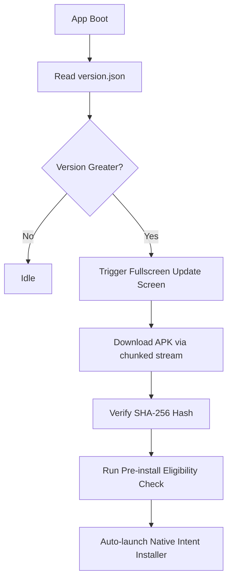
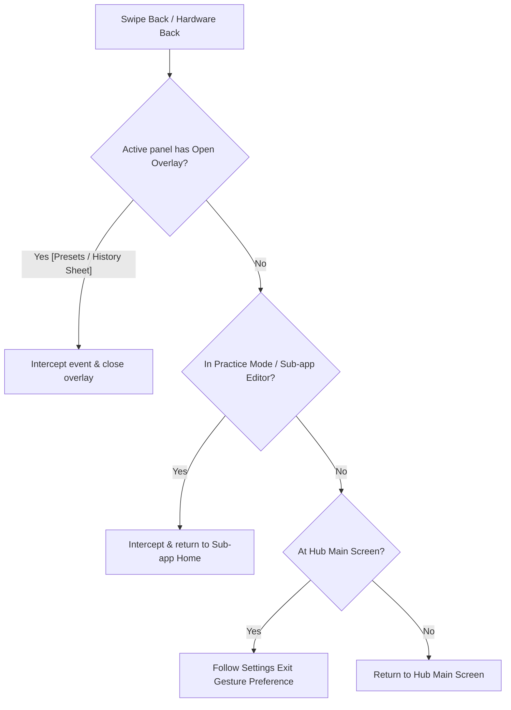

# AI Context Map — Chordex Studio / Livex Android

This map guides AI agents and developers on which files to inspect based on the problem scope, highlighting fragile and risky areas to prevent regressions and keep context window usage low.

---

## 1. Feature Map & Source File Locations

| Feature Area | Description | Primary Files to Inspect | Files to Avoid (Unless Scope-Relevant) |
| :--- | :--- | :--- | :--- |
| **Startup / Boot Performance** | Initial planets orbit animation, React mount deferrals, loading skeletons | [index.html](file:///c:/Users/ayuda/.gemini/antigravity/scratch/Studio/apps/studio-android/index.html) [main.tsx](file:///c:/Users/ayuda/.gemini/antigravity/scratch/Studio/apps/studio-android/src/main.tsx) [StudioHub.tsx](file:///c:/Users/ayuda/.gemini/antigravity/scratch/Studio/packages/ui-shared/src/components/StudioHub.tsx) [App.tsx](file:///c:/Users/ayuda/.gemini/antigravity/scratch/Studio/apps/studio-android/src/App.tsx) | Avoid heavy sub-app panels like `DrumEditor.tsx` or `SongsPanel.tsx`. |
| **Stagex Editor UI & Gestures** | Stage plot, touch selection boundaries, history bottom sheet, and back handler gestures | [StageCorePanel.tsx](file:///c:/Users/ayuda/.gemini/antigravity/scratch/Studio/packages/ui-android/src/components/StageCorePanel.tsx) [app.js](file:///c:/Users/ayuda/.gemini/antigravity/scratch/Studio/apps/studio-android/public/stage-core/app.js) [features.js](file:///c:/Users/ayuda/.gemini/antigravity/scratch/Studio/apps/studio-android/public/stage-core/features.js) [app.css](file:///c:/Users/ayuda/.gemini/antigravity/scratch/Studio/apps/studio-android/public/stage-core/app.css) | Avoid shared components under `ui-shared/components` that don't load the Stagex iframe. |
| **OTA Updates & APK Install** | State machine transitions (preparing to installed), update indicators, progress bars, install triggers | [otaUpdate.ts](file:///c:/Users/ayuda/.gemini/antigravity/scratch/Studio/packages/studio-core/src/lib/otaUpdate.ts) [apkDownloader.ts](file:///c:/Users/ayuda/.gemini/antigravity/scratch/Studio/packages/studio-core/src/lib/apkDownloader.ts) [UpdateIndicator.tsx](file:///c:/Users/ayuda/.gemini/antigravity/scratch/Studio/packages/ui-shared/src/components/UpdateIndicator.tsx) [StudioUpdateScreen.tsx](file:///c:/Users/ayuda/.gemini/antigravity/scratch/Studio/packages/ui-shared/src/components/StudioUpdateScreen.tsx) | Do not edit the native updater watchdog bridge in `capgoUpdater.ts` casually. |
| **Chordex Practice & Songs** | Chord progression parsing, song library practice sheet, floating chords overlay, and scrolling lyrics | [SongsPanel.tsx](file:///c:/Users/ayuda/.gemini/antigravity/scratch/Studio/packages/ui-shared/src/panels/SongsPanel.tsx) [SongPracticeView.tsx](file:///c:/Users/ayuda/.gemini/antigravity/scratch/Studio/packages/ui-shared/src/components/SongPracticeView.tsx) [progressions.ts](file:///c:/Users/ayuda/.gemini/antigravity/scratch/Studio/packages/studio-core/src/data/progressions.ts) [LibraryPanel.tsx](file:///c:/Users/ayuda/.gemini/antigravity/scratch/Studio/packages/ui-shared/src/panels/LibraryPanel.tsx) | Avoid audio worklet sampler logic in `drumAudio.ts` or `LabPanel.tsx`. |
| **Drumex Drum Sampler** | Step sequencer grid, kit samples mapping, BPM tempo controls, sound characteristics | [DrumEditor.tsx](file:///c:/Users/ayuda/.gemini/antigravity/scratch/Studio/packages/ui-shared/src/panels/DrumEditor.tsx) [drumAudio.ts](file:///c:/Users/ayuda/.gemini/antigravity/scratch/Studio/packages/studio-core/src/lib/drumAudio.ts) [drumLibrary.ts](file:///c:/Users/ayuda/.gemini/antigravity/scratch/Studio/packages/studio-core/src/lib/drumLibrary.ts) | Very heavy files (>5000 lines). Do not read or include in context unless Sequencer is the task focus. |
| **Vocalex Pitch Tuner** | Tuning lab, pitch detection, visual wave monitors, take recorder, and tracks editor | [VocalexApp.tsx](file:///c:/Users/ayuda/.gemini/antigravity/scratch/Studio/packages/ui-shared/src/vocalex/VocalexApp.tsx) [LabPanel.tsx](file:///c:/Users/ayuda/.gemini/antigravity/scratch/Studio/packages/ui-shared/src/vocalex/LabPanel.tsx) [TakesPanel.tsx](file:///c:/Users/ayuda/.gemini/antigravity/scratch/Studio/packages/ui-shared/src/vocalex/TakesPanel.tsx) | Avoid unrelated core sound systems like `drumAudio.ts`. |
| **Cloud Sync Engine** | Firestore queues, auth swaps, epoch trackers, sync states (`idle` -> `syncing` -> `success` / `error`) | [sync.ts](file:///c:/Users/ayuda/.gemini/antigravity/scratch/Studio/packages/studio-core/src/lib/sync.ts) [syncEngine.ts](file:///c:/Users/ayuda/.gemini/antigravity/scratch/Studio/packages/studio-core/src/lib/syncEngine.ts) [firebase.ts](file:///c:/Users/ayuda/.gemini/antigravity/scratch/Studio/packages/studio-core/src/lib/firebase.ts) | Highly fragile concurrency locks. Do not modify without formal state-machine diagrams. |
| **I18N / Localization** | Localization hooks (`useT`), language selection configs, JSON dictionaries | [en.json](file:///c:/Users/ayuda/.gemini/antigravity/scratch/Studio/packages/studio-core/src/i18n/en.json) (and other locales) [useT.ts](file:///c:/Users/ayuda/.gemini/antigravity/scratch/Studio/packages/studio-core/src/lib/useT.ts) [i18n.ts](file:///c:/Users/ayuda/.gemini/antigravity/scratch/Studio/packages/studio-core/src/lib/i18n.ts) | Do not edit the localized strings directly in the components; always use translation keys. |

---

## 2. Fragile & Risky Files (Handle with Extreme Caution)

* **[appVersion.ts](file:///c:/Users/ayuda/.gemini/antigravity/scratch/Studio/packages/studio-core/src/lib/appVersion.ts)**: Single source of truth for version definitions. Hardcoding strings elsewhere breaks the OTA checker boot evaluations.
* **[capgoUpdater.ts](file:///c:/Users/ayuda/.gemini/antigravity/scratch/Studio/packages/studio-core/src/lib/capgoUpdater.ts)**: Intercepts bundle swapping before React mounts in `main.tsx` to satisfy native rollback watchdogs.
* **[build.gradle](file:///c:/Users/ayuda/.gemini/antigravity/scratch/Studio/apps/studio-android/android/app/build.gradle)**: Contains production signing configuration thresholds. Do not weaken these rules or alter the release certificate fingerprint hashes.

---

## 3. Workflow Maps

### A. Android OTA Update Flow

### B. Navigation / Back Gesture Interception

