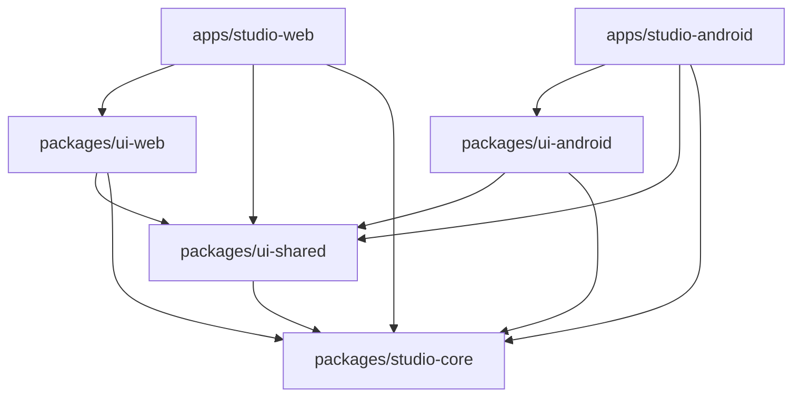

# Platform Separation Architecture

This document describes the architectural separation of the **Studio Web** and **Studio Android** applications.

---

## 1. Overview

To support independent release cycles, separate build pipelines, and prevent platform-specific layouts or code from leaking into incorrect targets, the repository has been reorganized into a monorepo structure using `pnpm`.

### Core Goals
- **Independent Build/Deploy**: Android work must never trigger Netlify web builds, and web changes must not affect native Android APKs.
- **Strict UI Boundaries**: Web-specific UI layouts and native Android-specific UI elements reside in separate, non-overlapping modules.
- **Independent Versioning**: Studio Web is versioned at `4.x.y` and Studio Android at `3.x.y` (versionName) / `6x` (versionCode) without conflicts.
- **Legacy Compatibility**: A Netlify proxy redirects requests for update metadata to the Firebase Hosting endpoint, ensuring backward compatibility for legacy Android clients.

---

## 2. Directory Layout & Monorepo Packages

The codebase is organized as follows:

```
├── apps/
│   ├── studio-web/             # Web application entry point (index.html, router, vite config)
│   └── studio-android/         # Android application entry point & native Android project folder
├── packages/
│   ├── studio-core/            # Pure business logic, state stores, i18n translations, sync engines
│   ├── ui-shared/              # Platform-neutral presentational components (buttons, text inputs, etc.)
│   ├── ui-web/                 # Desktop/mobile browser page layouts, landing pages, sidebars
│   └── ui-android/             # WebView page layouts, bottom navigation bar, native-only widgets
└── scripts/
    ├── enforce-import-boundaries.mjs # Validates import graph constraints
    ├── netlify-ignore.mjs      # Determines if a commit affects the web product
    └── version-manager.mjs     # Manages isolated versions for web and Android
```

---

## 3. Strict Import Boundaries

To maintain separation, imports between monorepo workspace packages are strictly regulated. The validation script `scripts/enforce-import-boundaries.mjs` runs on commits and PRs to verify the following constraints:



### Forbidden Import Rules
1. **Web App (`apps/studio-web`)** cannot import from `packages/ui-android`.
2. **Android App (`apps/studio-android`)** cannot import from `packages/ui-web`.
3. **Core (`packages/studio-core`)** cannot import from `ui-web`, `ui-android`, or `ui-shared` (it remains strictly UI-less).
4. **Shared UI (`packages/ui-shared`)** cannot import from platform UI packages or Capacitor-native plugins directly (which must be abstracted).

---

## 4. Independent Versioning

Versions are managed via `scripts/version-manager.mjs` using separate CLI commands:

- **Web Application**:
  ```bash
  pnpm version:web -- <version>
  ```
  Updates `apps/studio-web/package.json` and updates `WEB_VERSION` in `packages/studio-core/src/lib/appVersion.ts`.

- **Android Application**:
  ```bash
  pnpm version:android --name <versionName> --code <versionCode>
  ```
  Updates `apps/studio-android/package.json`, `apps/studio-android/android/app/build.gradle` (`versionName` and `versionCode`), and `NATIVE_VERSION` in `packages/studio-core/src/lib/appVersion.ts`.

---

## 5. CI/CD & Build Pipelines

### CI Workflows
- **Web CI (`web-ci.yml`)**: Triggered by changes in web app, shared packages, or root configs. Runs typechecking and building for web.
- **Android CI (`android-ci.yml`)**: Triggered by changes in Android app, shared packages, or native directory. Runs typechecking, WebView compilation, and Capacitor syncing.
- **Android Release (`android-release.yml`)**: Compiles signed production APKs, uploads them to GitHub Releases, and publishes the metadata updates JSON (`app-release.json`, `version.json`) to Firebase Hosting.

### Netlify Ignore Script
Netlify deployments are gated by `scripts/netlify-ignore.mjs`. The script analyzes changes between the current commit and the cached commit. If modifications are restricted only to Android-specific files (e.g. `apps/studio-android/**`, `packages/ui-android/**`, etc.), the Netlify build is skipped, saving build minutes and avoiding unnecessary deploys.

---

## 6. Legacy Update Redirect Bridge

To support older application wrappers (versions `3.6.28` to `3.6.35`) that hardcode the Netlify domain to fetch update manifests, `netlify.toml` specifies forced proxy redirects:

```toml
[[redirects]]
  from = "/app-release.json"
  to = "https://studio-30f44.web.app/app-release.json"
  status = 200
  force = true

[[redirects]]
  from = "/version.json"
  to = "https://studio-30f44.web.app/version.json"
  status = 200
  force = true

[[redirects]]
  from = "/apk/*"
  to = "https://studio-30f44.web.app/apk/:splat"
  status = 200
  force = true
```

Newer application wrappers fetch update manifests directly from the Firebase Hosting updates endpoint (`https://studio-30f44.web.app`), completing the separation.
