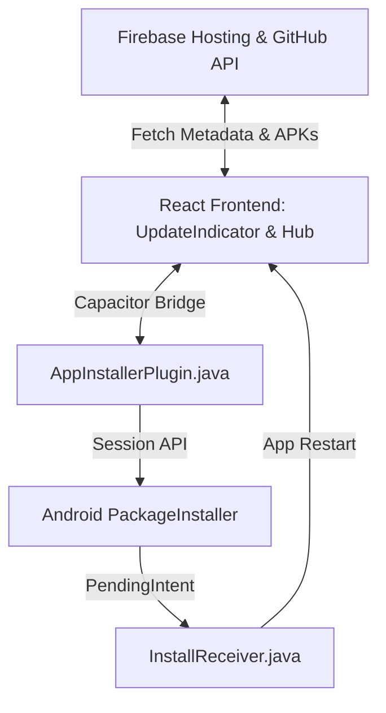
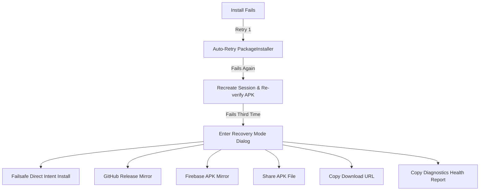

# Studio Updater Architecture

---
*   **Current Production Version**: v3.7.1
*   **Architecture Version**: 1.0.0
*   **Last Updated**: June 27, 2026
*   **Owner**: Engineering Team
*   **Subsystem**: Updater Core
*   **Status**: Production
---

This document specifies the technical design, responsibilities, and communication flows of the Studio in-app updater system.

---

## 1. Subsystem Overview & Responsibilities
The Studio updater is a production-grade version management and deployment system. Its primary goal is to ensure the Android application can download, verify, and apply updates reliably, without ever locking a user onto an outdated version.

---

## 2. Core Modules
1.  **Downloader**: Coordinates mirror resolution (GitHub Release ↔ Firebase Hosting ↔ Secondary Mirror), executes Range-based partial HTTP resume, and tracks download speed and progress.
2.  **Verifier**: Inspects downloaded APKs for integrity (SHA-256 validation), package matching (`com.chordex.app`), production signing certificate fingerprint matching, and versionCode constraints.
3.  **Installer**: Native Capacitor wrapper ([AppInstallerPlugin.java](file:///c:/Users/ayuda/Documents/Studio/chordex-app/apps/studio-android/android/app/src/main/java/com/chordex/app/AppInstallerPlugin.java)) coordinating the Android `PackageInstaller` Session API and legacy `ACTION_VIEW` intent fallbacks.
4.  **Handoff Receiver**: Android `BroadcastReceiver` ([InstallReceiver.java](file:///c:/Users/ayuda/Documents/Studio/chordex-app/apps/studio-android/android/app/src/main/java/com/chordex/app/InstallReceiver.java)) catching install success/failure feedback intents from the operating system.
5.  **Diagnostics Engine**: Telemetry tracker compiling connectivity tests, storage limits, and error stacktraces into exportable JSON health reports.

---

## 3. Component Relationships & UI
-   **Update Badge / Pill**: Renders dynamically inside the settings page or hub menu to indicate update availability.
-   **Notification Banner / Pill**: Renders on the main application interface with a z-index of `8900` to draw attention to ready updates.
-   **Update Modal (UpdateIndicator)**: The primary dialog where the user triggers checks, views downloads, handles permissions, and initiates installation.

---

## 4. Native ↔ React Bridge
Communication between the React frontend and the native Android wrapper is facilitated by Capacitor plugins:
-   **TypeScript to Native**: Calls `AppInstaller.installApk`, `AppInstaller.installApkDirect`, `AppInstaller.downloadApk`, or `AppInstaller.getInstalledAppInfo`.
-   **Native to TypeScript**: Fires listener events:
    -   `apkDownloadProgress`: Sends progress status objects (`{ progress: number }`) during downloads.
    -   `onInstallStatusChanged`: Real-time PackageInstaller broadcast and session callback events (`{ status: number, message: string, progress?: number }`).

---

## 5. Network & Mirror Integration
-   **GitHub Integration**: Fetches release metadata from the public repository release endpoint. Directs update downloads to release assets when available.
-   **Firebase Integration**: Fetches `app-release.json` from Firebase Hosting. Resolves mirrors, manual downloads, and alternative channels if GitHub is rate-limited or unreachable.

---

## 6. Handoff Flow (PackageInstaller ↔ PendingIntent ↔ BroadcastReceiver)
1.  **Session Setup & Callback**: `AppInstallerPlugin` creates a `PackageInstaller.Session` and registers a `SessionCallback` on the main loop. This callback intercepts session active and progress change events in real time.
2.  **APK Write**: Streams the APK file from cache into the session output stream.
3.  **Handoff Intent**: Registers a `PendingIntent` referencing the `InstallReceiver` class.
4.  **OS Commit**: Calls `session.commit(statusReceiver)`. The OS suspends execution and overlays the system installer confirmation dialog.
5.  **Broadcast Response & Session monitoring**:
    -   **Pending Action (-1)**: Broadcast fires when the confirmation prompt shows. React transitions to `WAITING_FOR_ANDROID_CONFIRMATION`.
    -   **Session Active (-2)**: SessionCallback fires when the user presses "Update". React transitions to `INSTALLING` (spinner shown) and writes the update success local storage flags (`studio:showUpdateSuccess` and `studio:appliedUpdateVersion`).
    -   **Session Progress (-3)**: SessionCallback tracks system copy progress.
    -   **Success (0)**: `InstallReceiver` logs success status. The OS terminates the process.
    -   **Failure (3 / others)**: Clears all local storage success flags and transitions React back to `failed`.

---

## 7. Recovery & Fallback Flows

-   **Direct Legacy Installer (Fallback 5)**: Launches an `ACTION_VIEW` intent with a secure `FileProvider` `content://` URI to override `PackageInstaller` session blocks.
-   **Share Update APK (Fallback 9)**: Opens the system sharing sheet using `@capacitor/share` to allow backup copying or manual sideloading.

### 7.1 GitHub Release Fallback (Permanent Manual Recovery)
To ensure users are never trapped without an update path, the system includes a permanent **GitHub Release Fallback** integrated directly into the user interface:
- **Settings → Updates**: A premium updates card displays the installed version, latest available version, and release channel. It features an `Open Official GitHub Release` button.
- **Update Failure Screen**: A third action button, `Download from GitHub` (visually distinct outlined button with a GitHub icon), is rendered below the Retry and Cancel actions on both the progress screen and the failure dialog.
- **Recovery Mode**: The primary manual action is updated to `Download Latest Release`, prioritizing the official GitHub signed APK.
- **Confirmation Sheet**: Before launching the browser, a confirmation sheet is displayed to explain that the APK is published on the official repository, ensuring a safe, guided recovery experience.

---

## 8. Startup Sequence and Simplified Intro
1.  **Redesigned Intro Overlay**: The planets animation is replaced by a minimal, lightweight Studio logo fade and scale keyframe animation. No canvases, physics, or particle loops are run, keeping the main thread free for React bootstrapping.
2.  **Linear State Transitions**: The state machine advances linearly, with each state entered exactly once and exited exactly once:
    `BOOT` → `PREPARE` → `INITIALIZE` → `INTRO_RUNNING` → `LAYOUT_READY` → `ANIMATION_READY` → `INTRO_FINISHED` → `HUB_VISIBLE` → `READY`.
3.  **Done Success Screen Check**: On first launch of the updated version, the success screen displays with a "Done" button. Only when the user taps "Done" is the version logged to `studio:installedVersions` and `studio:appliedVersions` in local storage, preventing early "Studio is up to date" assertions.
