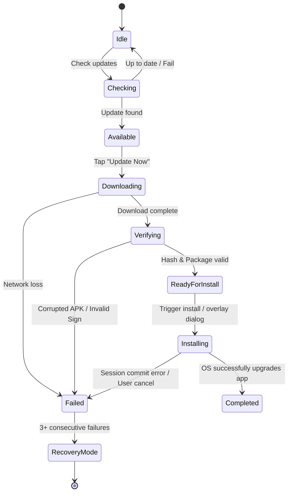

# Updater State Machine

---
*   **Current Production Version**: v3.7.1
*   **Architecture Version**: 1.0.0
*   **Last Updated**: June 27, 2026
*   **Owner**: Engineering Team
*   **Subsystem**: Updater State Machine
*   **Status**: Production
---

This document details the update system's states, valid/invalid transitions, timeouts, and ownership rules.

---

## 1. State Diagram

---

## 2. States Description
-   **Idle**: Default quiescent state. No update activities active.
-   **Checking**: Queries version metadata (`app-release.json` / GitHub releases).
-   **Available**: An eligible update is resolved and waiting for user confirmation.
-   **Downloading**: Resolving mirror urls and fetching the APK file.
-   **Verifying**: Calculating and comparing SHA-256 hashes and validating Android signing certificates.
-   **Installing**: Handing over session control to the native PackageInstaller.
-   **Completed**: Installation success; application registers a version change and restarts.
-   **Failed**: Update is halted due to download failures, validation mismatches, or installer crashes.
-   **Recovery Mode**: Active when consecutive failures exceed the threshold (3), overlaying failsafe manual and direct action options.

---

## 3. Transitions

### Valid Transitions
-   `Idle` ➔ `Checking` (Manual button tap or automated visibility trigger)
-   `Checking` ➔ `Available` (Upgrade is resolved)
-   `Checking` ➔ `Idle` (No update required or network unreachable)
-   `Available` ➔ `Downloading` (User triggers "Update Now")
-   `Downloading` ➔ `Verifying` (APK file successfully closed and cached)
-   `Downloading` ➔ `Failed` (Network loss or server error)
-   `Verifying` ➔ `Installing` (Hash, package name, and signature check out)
-   `Verifying` ➔ `Failed` (Any verification criteria checks fail)
-   `Installing` ➔ `Completed` (Success code returned to InstallReceiver)
-   `Installing` ➔ `Failed` (Cancellation or session timeout)
-   `Failed` ➔ `Recovery Mode` (Failures count incremented ➔ 3+)
-   `Failed` ➔ `Downloading` (User taps "Try Again")

### Invalid Transitions
Any transitions bypassing sequence order are blocked:
-   `Idle` ➔ `Installing` (**BLOCKED**: Must download and verify first).
-   `Downloading` ➔ `Installing` (**BLOCKED**: Must check hash and signature first).
-   `Installing` ➔ `Idle` (**BLOCKED**: Cannot quit installation mid-sequence).

---

## 4. Timeouts & Retries
-   **Metadata Check Timeout**: 10 seconds.
-   **Download Retry**: 3 attempts per source using exponential backoff (2s, 4s, 8s).
-   **Handoff / Installer Timeout**: 60 seconds (monitored by native intent listeners).
-   **Handoff Retries**: If the session fails on commit, the system automatically tries twice (reloading preferences and recreating installer sessions) before transitioning to Recovery Mode.

---

## 5. State Ownership
-   **Central State Object**: Owned globally by the React frontend (`globalOtaState` in `otaUpdate.ts`).
-   **Native Handlers**: Native Java plugins do not own the lifecycle states; they strictly report raw download progress (`apkDownloadProgress` events) and execution outcomes (`getLastInstallResult`) to the central frontend controller.
